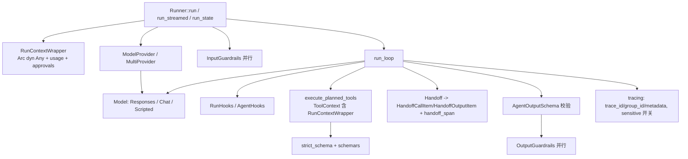

## 产品概述

对 Rust 版 OpenAI Agents SDK（`openai-agents` 0.1.0）开展第二阶段对齐，以 openai-agents-python v0.23.1 为标准。按用户给定顺序修复已发现的行为分叉、补齐核心缺项，并同步更新兼容性文档。允许破坏性 API 变更，以对齐 Python 为先。

## 核心功能（按执行顺序）

1. **修复 B1–B6**

- B1：`last_agent` 返回真正最后运行的 agent（handoff 后为目标 agent）。
- B2：`#[function_tool]` 为 Vec、嵌套 struct、enum、Map 等参数生成完整、strict 的 JSON Schema。
- B3：`&str` 等引用类型参数可用，或在编译期给出明确报错。
- B4/B5：`StopOnFirstTool`/`StopAtTools` 提前结束时，`reset_tool_choice` 的处理和同批工具输出 item 的生成与 Python 一致。
- B6：function_call 缺少 `call_id` 时抛出模型行为错误，不再静默兜底。

2. **补 D-A/D-B 并复核全部 D 项**

- 新增 HandoffCall、HandoffOutput（含源/目标 agent）、Reasoning 三类运行项。handoff 时发出 handoff span。RunState JSON 同步支持这些新类型。
- 逐项评估 D-C~D-L 及已登记的 D-001~D-012，判断是否属于 Rust 语言差异。不合理的项改为 Python 行为：
    - 中断策略：以 Python 为准，必要时增加 parity 场景。
    - tracing：per-run 开关；记录 span 的 start 事件；支持注入 trace_id、group_id、metadata；`flush_traces` 真正生效；`trace_include_sensitive_data` 与 `EnabledWithoutData` 联动。
    - 其他：清理死代码；Chat Completions 遇到 conversation_id 时显式报错；错误类型带 source chain；修正 README 中默认 API 的表述。
- 合理保留的差异写入 DEVIATIONS。

3. **ModelSettings 扩展到约 15 个常用字段**：在原有字段基础上新增 frequency_penalty、presence_penalty、truncation、reasoning、verbosity、metadata、store、top_logprobs、include_usage、response_include、extra_headers、extra_args 等。tool_choice 改为枚举。提供与 Python 一致的 `resolve` 合并语义，并在 Responses/Chat 两种模型中正确映射。
4. **output_type 结构化输出**：Agent 可声明输出类型。模型按 JSON Schema 输出，SDK 校验后提供强类型取值接口，校验失败抛模型行为错误。
5. **Guardrails + Hooks + Context**

- 类型擦除的运行上下文：可下转型取回用户 context，并携带 usage 与审批状态，贯穿工具、守卫、钩子和动态指令。
- 输入/输出守卫及 tripwire 错误。
- Run 级与 Agent 级生命周期钩子。
- 动态 instructions。

6. **ModelProvider 与字符串模型名解析**：提供 provider 抽象、OpenAI provider 和多 provider 路由（支持 `openai/` 前缀）。`Agent.model_name` 与 RunConfig 中的模型名都能解析为真实模型。
7. **文档同步**：COMPAT 中流式能力的状态如实标注；DEVIATIONS 补录尚未登记的分叉；README 与示例说明保持一致。

## 技术栈

- 沿用现有技术栈：Rust 2021、tokio、async-trait、serde/serde_json、thiserror、futures；`openai` feature 下使用 async-openai 0.42 + reqwest；`testing` feature 使用 wiremock。
- 新增依赖：`schemars`（建议 1.x，需确认 `JsonSchema` derive 在 serde 属性下的兼容性），作为主 crate 的非可选依赖，并由 `openai_agents::schemars` 重新导出，让宏生成代码不要求用户直接依赖它。
- 本地无 vendored 源码。执行各里程碑前，通过 `https://raw.githubusercontent.com/openai/openai-agents-python/v0.23.1/src/agents/...` 抓取对应 Python 源码（`run_internal/`、`items.py`、`guardrail.py`、`lifecycle.py`、`run_context.py`、`agent_output.py`、`strict_schema.py`、`models/multi_provider.py`、`models/openai_provider.py`、`tracing/`）作为行为基准。

## 实施策略

按里程碑串行推进，每个里程碑结束都要求三层验证通过（`cargo test --no-default-features`、`cargo test --features testing`、parity golden）后再进入下一阶段。破坏性变更集中在里程碑 1–2 和 5（签名统一引入 Context），避免反复改动公共 API。

### 关键技术决策

1. **Context 类型擦除**

- 新增 `RunContextWrapper { context: Option<Arc<dyn Any+Send+Sync>>, usage: Arc<Mutex<Usage>>, approvals: ApprovalStore 句柄 }`，提供 `context::<T>() -> Option<&T>` 和 `try_context::<T>() -> Result<&T, UserError>`。
- `RunOptions.context: Option<Arc<dyn Any+Send+Sync>>` 是唯一入口。
- `ToolContext` 内嵌 `run_context: RunContextWrapper`。
- 好处：Agent/Runner 不带泛型参数，改动面可控。代价：类型错误要到运行时才暴露。用 `try_context` 给出可定位的错误信息作为缓解。

2. **schemars + 自实现 strict 化**

- 新增 `src/strict_schema.rs`，移植 Python `ensure_strict_json_schema`：object 补 `additionalProperties:false`、所有 properties 进 `required`、展开 `$ref`/`$defs`、处理 `anyOf`/`allOf`、移除 `default:null`。
- 宏改为生成一个隐藏的 `#[derive(Deserialize, JsonSchema)] struct __Args` 作为参数载体。schema 取自 `schema_for!(__Args)` 再做 strict 化；参数解析统一为 `serde_json::from_str::<__Args>`。这样 B2、B3 一并解决：`&str` 在编译期报错，提示改用 `String`；`Option<T>` 走 serde 默认语义。
- 支持可选首参 `ctx: &ToolContext` / `RunContextWrapper`，按类型识别后注入。
- 函数 doc comment 作为 description；参数上的 `///` 注释通过 schemars 的 `description` 透传，从而部分收窄 D-002。

3. **output_type**

- 抽象 trait `AgentOutputSchemaBase { is_plain_text, name, json_schema, is_strict_json_schema, validate_json(&str) -> Result<Value, ModelError> }`。
- 提供 `AgentOutputSchema::of::<T: JsonSchema + DeserializeOwned>()`（Python 会把非 object 类型包装为 `{"response": ...}`，此行为需一并对齐）。
- `Agent.output_type: Option<Arc<dyn AgentOutputSchemaBase>>`。
- `RunResult.final_output` 保持 `Value`，新增 `final_output_as::<T>()`。
- Responses 映射为 `text.format = {type: json_schema, name, schema, strict}`，Chat 映射为 `response_format`。
- 有 output_type 时，只有当消息能通过 schema 校验才视为最终输出，与 Python 的 `is_final_output` 判定一致。

4. **Guardrails/Hooks**

- 使用 `async_trait` 定义 `RunHooks` 与 `AgentHooks`，方法全部提供默认空实现：on_agent_start/end、on_handoff、on_tool_start/end、on_llm_start/end。`RunOptions.hooks` 与 `Agent.hooks` 均为 `Option<Arc<dyn ...>>`。
- `InputGuardrail` / `OutputGuardrail` 用 `Arc<dyn Fn(RunContextWrapper, &Agent, ...) -> BoxFuture<GuardrailFunctionOutput>>` 包装，并提供 `input_guardrail(name, f)` / `output_guardrail(name, f)` 构造函数。
- 输入守卫只在起始 agent 的首轮运行，与模型调用并行（`tokio::join`/`select`），tripwire 触发即中止。输出守卫在最终输出产生后并行运行。
- 新增 `AgentsError::InputGuardrailTripwire(..)` / `OutputGuardrailTripwire(..)`，携带 `GuardrailResult`。`RunResult` 增加 `input_guardrail_results` / `output_guardrail_results`。

5. **ModelProvider**

- `trait ModelProvider: Send+Sync { fn get_model(&self, name: Option<&str>) -> Result<Arc<dyn Model>, UserError> }`。
- `OpenAIProvider` 从环境变量 `OPENAI_API_KEY`/`OPENAI_BASE_URL` 读取配置（密钥只来自环境变量或显式参数，不落日志），并依据 `get_default_openai_api()` 选择 Responses 或 Chat 模型，对同名模型做缓存。
- `MultiProvider` 解析 `prefix/model`，默认前缀为 `openai`，支持注册自定义前缀映射。
- `resolve_model` 的优先级改为：RunConfig.model（实例或名称）> agent.model（实例）> agent.model_name > 默认模型名，后两者都经由 `RunConfig.model_provider`。
- 关闭 `openai` feature 时，默认 provider 返回明确的 UserError。
- `RunConfig.model` 改为 `Option<ModelRef>` 枚举 `{ Instance(Arc<dyn Model>), Name(String) }`。

### 性能与可靠性

- 工具执行继续用 `try_join_all` 并发。新增 `ToolExecutionConfig.max_function_tool_concurrency` 可选上限（`futures::stream::buffer_unordered`），结果仍按模型 tool-call 顺序排序。
- 守卫与模型调用并行，不增加首轮延迟。输出守卫在 tripwire 触发后取消其余守卫任务。
- strict schema 在 FunctionTool 和 AgentOutputSchema 构造时一次性计算并缓存在结构体内，不在每轮重算。
- InMemoryProcessor 新增 start 事件记录，用 Mutex 包住 Vec，开销可忽略。批量导出暂不引入（D-004 继续保留）。

## 实施注意事项

- **B4/B5/D-C 先核对 Python 源码**：在 `run_internal/` 中定位 tool_use_behavior 的判定、reset_tool_choice 的时机，以及 interruptions 与非审批工具的处理顺序，先写 parity 场景 JSON（`tests/parity/scenarios/`）生成 golden，再改 Rust，避免凭推测改动。
- **RunState JSON**：新增 item kind（`handoff_call`、`handoff_output`、`reasoning`）。schema 版本升到 `openai-agents-rust/2`；`from_json` 同时接受 v1（缺失的新字段按默认值处理），兼顾已落盘的状态。
- **ModelRequest 扩展**：增加 `handoffs`（handoff 工具与普通工具分开传递，便于 span 与 item 区分）和 `output_schema: Option<&dyn AgentOutputSchemaBase>`。ScriptedModel 的 `ModelCall` 同步记录这两项，供测试断言。
- **安全**：OpenAIProvider 只读取环境变量，不在 Debug/trace 中输出 api_key（`OpenAiEndpoint` 的 Debug 需脱敏）。`trace_include_sensitive_data=false` 时，span 不记录工具参数/输出与模型 input/output。默认值读取环境变量 `OPENAI_AGENTS_TRACE_INCLUDE_SENSITIVE_DATA`，与 Python 一致。
- **爆炸半径控制**：每个里程碑同步更新 `examples/` 与 `tests/` 中因签名变化需要调整的调用点。只修改与本次需求相关的模块，不顺带重构其他模块。
- **日志**：继续使用 `tracing` crate。错误信息不内嵌完整 payload。

## 架构设计



## 目录结构

```
openai-agents-rs/
├── Cargo.toml                         # [MODIFY] 新增 schemars 依赖；版本保持 0.1.x 或升到 0.2.0 以标记破坏性变更
├── macros/src/lib.rs                  # [MODIFY] 重写 function_tool：生成隐藏 __Args（Deserialize+JsonSchema），schema 经 openai_agents::strict_schema 处理；&str 等引用类型编译期报错；识别并注入首参 ctx；提取 fn/参数 doc 作为 description；保留 name/description/needs_approval 属性
├── src/
│   ├── lib.rs                         # [MODIFY] 重新导出新增模块与类型（RunContextWrapper、guardrail、lifecycle、AgentOutputSchema、ModelProvider/MultiProvider/OpenAIProvider、新 RunItem 类型、schemars）
│   ├── strict_schema.rs               # [NEW] ensure_strict_json_schema 移植：additionalProperties:false、required 补全、$ref/$defs 展开、anyOf/allOf 递归；含单元测试
│   ├── run_context.rs                 # [NEW] RunContextWrapper：类型擦除 context、context::<T>/try_context::<T>、共享 usage、审批查询；Clone 廉价（全 Arc）
│   ├── agent_output.rs                # [NEW] AgentOutputSchemaBase trait、AgentOutputSchema::of::<T>()（非 object 类型包装为 response 字段）、validate_json
│   ├── guardrail.rs                   # [NEW] GuardrailFunctionOutput、InputGuardrail/OutputGuardrail、input_guardrail()/output_guardrail() 构造、InputGuardrailResult/OutputGuardrailResult
│   ├── lifecycle.rs                   # [NEW] RunHooks / AgentHooks async trait，全部提供默认空实现
│   ├── agent.rs                       # [MODIFY] instructions 改为 Instructions 枚举（Static/Dynamic 闭包）；新增 output_type、input_guardrails、output_guardrails、hooks、clone_with；ToolUseBehavior 增加 Custom(ToolsToFinalOutputFunction)；AsToolConfig 增加 is_enabled、custom_output_extractor、run_config
│   ├── run.rs                         # [MODIFY] 修复 B4/B5、按 Python 调整 D-C；handoff 生成新 item + handoff_span + on_handoff 钩子；删除 D-D 死代码；接入守卫/钩子/context/output_schema/provider；merge_settings 改为调用 ModelSettings::resolve；RunConfig 新增 model_provider、trace_id、group_id、trace_metadata、trace_include_sensitive_data、input/output_guardrails、tool_execution；RunOptions 新增 context、hooks
│   ├── result.rs                      # [MODIFY] B1：持有 last_agent: Arc<Agent>，last_agent() 无参返回；新增 final_output_as::<T>()、守卫结果字段；StreamingSnapshot 同步
│   ├── items.rs                       # [MODIFY] RunItem 增加 HandoffCall/HandoffOutput（source/target agent 名）/Reasoning；B6 中 function_call_parts 返回 Result，缺 call_id 时报 ModelError::Behavior
│   ├── handoffs.rs                    # [MODIFY] Handoff 增加 input_json_schema、on_invoke_handoff、input_filter、is_enabled、strict_json_schema；HandoffInputData；get_transfer_message
│   ├── run_state.rs                   # [MODIFY] 序列化新 item kind；schema 版本升为 v2 并兼容读取 v1；携带 context 无关字段
│   ├── stream_events.rs               # [MODIFY] AgentUpdated 携带 Arc<Agent>；HandoffRequested/HandoffOccured 对应新 item
│   ├── tool.rs                        # [MODIFY] ToolContext 加入 run_context；is_enabled 支持动态闭包；FunctionTool 构造时缓存 strict schema
│   ├── model_settings.rs              # [MODIFY] 扩展到约 18 字段（含 ToolChoice 枚举、Reasoning、Truncation、Verbosity）；resolve() 合并语义（extra_args 字典合并）；serde 序列化
│   ├── usage.rs                       # [MODIFY] 增加 input_tokens_details/output_tokens_details/request_usage_entries，add() 与 Python 一致
│   ├── error.rs                       # [MODIFY] 新增 Guardrail tripwire 变体、ModelBehavior 语义；Tool/Internal 改为带 #[source] 的结构
│   ├── tracing/mod.rs                 # [MODIFY] SpanData 增加 Handoff/Response/Guardrail；Trace 增加 group_id/metadata 且可注入 trace_id；processor 记录 start 事件；flush_traces 调用 processor.force_flush；per-run 禁用优先于全局开关
│   ├── model/mod.rs                   # [MODIFY] ModelRequest 增加 handoffs、output_schema；新增 ModelProvider trait、ModelRef 枚举
│   ├── model/provider.rs              # [NEW] MultiProvider（前缀路由、自定义映射）、无 openai feature 时的报错实现
│   ├── model/scripted.rs              # [MODIFY] ModelCall 记录 output_schema/handoff 名称；补 assistant_message/function_call 辅助
│   └── model/openai/
│       ├── mod.rs                     # [MODIFY] OpenAIProvider（读取环境变量、按默认 API 选择模型、按名缓存）；apply_model_settings_chat 映射新字段；Debug 输出脱敏 api_key
│       ├── responses.rs               # [MODIFY] 映射新字段（reasoning/truncation/store/metadata/text.format 等）、extra_headers；output_schema 映射为 text.format
│       └── chat_completions.rs        # [MODIFY] 映射新字段与 response_format；有 conversation_id 时返回 ModelError::Unsupported；SSE 中解析 usage 明细
├── tests/
│   ├── behavior_runner.rs             # [MODIFY] B1/B4/B5/B6、output_type、provider 解析用例
│   ├── behavior_handoff.rs            # [MODIFY] HandoffCall/OutputItem、handoff_span、last_agent 用例
│   ├── behavior_hitl.rs               # [MODIFY] D-C 新行为、RunState v1->v2 兼容读取用例
│   ├── behavior_tracing.rs            # [MODIFY] start 事件、group_id/trace_id 注入、sensitive 开关
│   ├── behavior_guardrails.rs         # [NEW] 输入/输出 tripwire、并行执行、结果字段
│   ├── behavior_hooks_context.rs      # [NEW] 钩子调用顺序、context 下转型、动态 instructions
│   ├── function_tool_macro.rs         # [MODIFY] Vec/嵌套 struct/enum schema 快照、ctx 注入、&str 编译期报错（trybuild 或 doc 说明）
│   ├── strict_schema.rs               # [NEW] 与 Python ensure_strict_json_schema 输出对照
│   ├── openai_wiremock.rs             # [MODIFY] 新 ModelSettings 字段和 output schema 的请求体断言
│   └── parity/scenarios/*.json        # [NEW] handoff_basic、stop_on_first_tool_multi、hitl_mixed_approval、structured_output 场景
├── scripts/run_parity.py              # [MODIFY] 支持新场景（handoff、structured output、混合审批）
├── examples/common/mod.rs             # [MODIFY] 说明 examples harness 默认为 chat，库默认为 Responses；可改用 OpenAIProvider
├── examples/09_structured_output.rs   # [NEW] output_type 示例
├── examples/10_guardrails_hooks.rs    # [NEW] 守卫、钩子与 context 示例
├── README.md                          # [MODIFY] 修正默认 API 描述（D-I），更新支持矩阵与 Phase 说明
└── docs/
    ├── COMPAT.md                      # [MODIFY] run_streamed 标为 P（引用 D-011）；新增 guardrails、hooks、context、output_type、provider、ModelSettings 行
    └── DEVIATIONS.md                  # [MODIFY] 复核 D-001~D-012；已修复项标为 Aligned；保留项从 D-013 起补录并注明是否属语言差异
```

## 关键代码结构

```rust
// src/run_context.rs
#[derive(Clone)]
pub struct RunContextWrapper {
    context: Option<Arc<dyn Any + Send + Sync>>,
    usage: Arc<Mutex<Usage>>,
}
impl RunContextWrapper {
    pub fn context<T: Any + Send + Sync>(&self) -> Option<&T>;
    pub fn try_context<T: Any + Send + Sync>(&self) -> Result<&T, UserError>;
    pub fn usage(&self) -> Usage;
}

// src/model/mod.rs
pub trait ModelProvider: Send + Sync {
    fn get_model(&self, model_name: Option<&str>) -> Result<Arc<dyn Model>, UserError>;
}
#[derive(Clone)]
pub enum ModelRef { Instance(Arc<dyn Model>), Name(String) }

// src/agent_output.rs
pub trait AgentOutputSchemaBase: Send + Sync + std::fmt::Debug {
    fn is_plain_text(&self) -> bool;
    fn name(&self) -> &str;
    fn json_schema(&self) -> &serde_json::Value;
    fn is_strict_json_schema(&self) -> bool;
    fn validate_json(&self, json_str: &str) -> Result<serde_json::Value, ModelError>;
}
```

## Agent 扩展

### SubAgent

- **code-explorer**
- 用途：每个里程碑开工前，精确定位需要修改的调用点。例如 `RunItem` 的所有 match 分支、`ToolContext` 的构造点、`merge_settings`/`resolve_model` 的引用、examples/tests 中受签名变化影响的位置。
- 预期结果：拿到带文件和行号的完整影响清单，避免破坏性变更遗漏调用点导致编译失败。

### Skill

- **lsp-code-analysis**
- 用途：在调整 `RunResult::last_agent`、`ToolContext`、`ModelSettings.tool_choice`、`RunConfig.model` 等公共签名前，做引用与调用层级分析。
- 预期结果：得到每个签名变更的影响面，并借助重构预览确认修改范围。
- **git-commit-message**
- 用途：每个里程碑完成后，按 docs/CONTRIBUTING.md 约定的 Conventional Commits 风格生成提交信息。
- 预期结果：每个里程碑对应一个结构清晰的独立提交，方便回溯与 review。